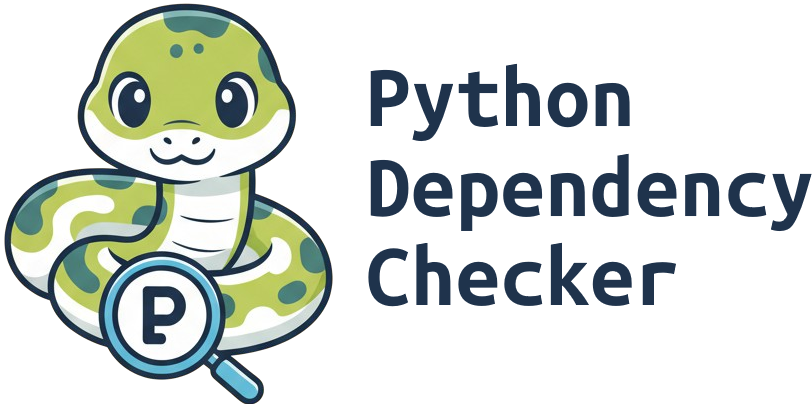

[](https://github.com/marketplace)
[](https://github.com/aleqsd/python-dependency-checker/actions/workflows/ci.yml)
[](#)
[](#)

🔍 **Python Dependency Checker** is a composite GitHub Action that keeps your dependency lists accurate. It compares imports found in your codebase against the dependencies declared in `requirements.txt` or `pyproject.toml`, flagging everything that is missing or unused with colourful Rich-powered logs and a neat Markdown summary.

---

## ✨ Key Features

- 🎯 Detects missing and unused dependencies in your project.
- 🔄 Supports two engines: [`deptry`](https://github.com/fpgmaas/deptry) and [`pip-check-reqs`](https://github.com/r1chardj0n3s/pip-check-reqs).
- 📝 Publishes a Markdown recap to `GITHUB_STEP_SUMMARY`.
- 🌈 Rich-driven logs with emojis make results easy to scan directly in GitHub Actions.
- 🚦 Configurable failure behaviour via `fail-on-warn`.

---

## 🚀 Quick Start

```yaml
jobs:
  check-dependencies:
    runs-on: ubuntu-latest
    steps:
      - uses: actions/checkout@v4
      - uses: aleqsd/python-dependency-checker@v1
```

---

## ⚙️ Full Example

```yaml
jobs:
  check-dependencies:
    runs-on: ubuntu-latest
    steps:
      - uses: actions/checkout@v4
      - name: 🐍 Run Python Dependency Checker
        uses: aleqsd/python-dependency-checker@v1
        with:
          path: .
          mode: deptry
          fail-on-warn: true
```

---

## ⚙️ Inputs

| Input          | Default  | Description                                                   |
| -------------- | -------- | ------------------------------------------------------------- |
| `path`         | `.`      | Root directory of the project to analyse.                     |
| `mode`         | `deptry` | Analysis engine. Accepted values: `deptry`, `pip-check-reqs`. |
| `fail-on-warn` | `false`  | When `true`, unused dependencies trigger a failed run.        |

---

## 🧪 Sample Output

```
🧭 Python Dependency Checker started.
ℹ️ Checking . using deptry (fail-on-warn=True).
🔍 Running deptry analysis...
╭─────────────────────────────── Dependency Report ───────────────────────────────╮
│  Status   │ Packages                                                            │
│ ❌ Missing│ requests                                                             │
│ 🪶 Unused │ boto3                                                                │
╰────────────────────────────────────────────────────────────────────────────────╯
🚨 Dependency issues detected.
```

Add the Rich-rendered summary (for example with a screenshot) to highlight the experience in your README once the action is running inside your repository’s workflows.

---

## 🧰 How It Works

- Installs Python 3.11 via `actions/setup-python`.
- Pulls in `deptry`, `pip-check-reqs`, and `rich` before running.
- Calls `main.py`, which inspects your imports, prints a Rich table, and updates the `GITHUB_STEP_SUMMARY`.

---

## 🧪 Tests

- Install test dependencies: `pip install -r requirements-dev.txt`.
- Run the suite from the repository root: `python -m pytest`.

---

## 📄 License

Released under the [MIT License](LICENSE).
